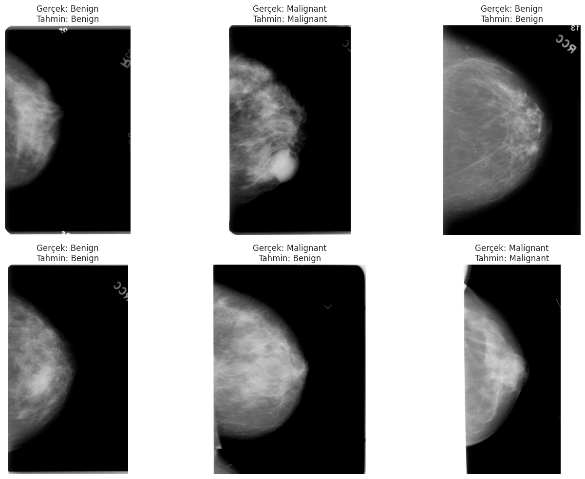

# Breast Cancer Classification

Bu proje, [CBIS-DDSM (Curated Breast Imaging Subset of Digital Database for Screening Mammography)](https://www.kaggle.com/datasets/awsaf49/cbis-ddsm-breast-cancer-image-dataset/data) veri setini kullanarak memogram görüntülerinin sınıflandırılması amacıyla geliştirilmiştir. Proje, VGG16 ve ResNet50V2 gibi iki farklı transfer learning modelini birleştirerek entegre bir model oluşturmayı hedeflemektedir. Bu iki güçlü derin öğrenme mimarisinin birleşimi, memogram görüntülerinden elde edilen özelliklerin daha etkin bir şekilde çıkarılmasını hedeflenmektedir.

Veri seti, farklı türde meme kanseri vakalarını içeren tam memogram görüntüleri içerir. Proje, bu görüntüleri işleyerek, her iki modelin önceden eğitilmiş ağırlıklarını kullanarak son katmanların çıkarılması ile öznitelik çıkarımı yapar. VGG16 modelinden ve ResNet50V2 modelinden elde edilen özellikler, global average pooling ile öznitelik vektörlerine dönüştürülür ve bu öznitelikler daha sonra birleştirilerek tam bağlantılı katmanlar üzerinde işlenir. Sonuç olarak, entegre model, ikili sınıflandırma problemini çözmek için eğitim verileri üzerinde eğitilir ve hem doğruluk hem de kayıp değerleri ile değerlendirilir.

