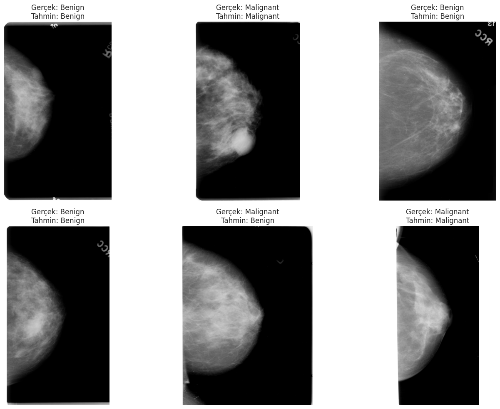

<div align="center">

# Breast Cancer Classification

[](https://www.python.org/)
[](https://www.tensorflow.org/)
[](https://keras.io/)
[](https://opencv.org/)
[](https://jupyter.org/)
[](https://www.kaggle.com/)
[](LICENSE)



**[Model Download](https://drive.google.com/drive/folders/1PKGFF6RSPcC4kjQHR92YjeIvWn5wR4Vn?usp=drive_link)**

---

**[English](#english)** | **[Türkçe](#turkish)**

</div>

---

## <a name="english"></a>🇬🇧 English

# Breast Cancer Classification with Deep Learning

This project implements a deep learning model for classifying mammogram images using the CBIS-DDSM dataset. The model combines two powerful pre-trained architectures (VGG16 and ResNet50V2) to create an integrated ensemble model for binary classification of breast cancer cases.

## Overview

The project uses transfer learning to leverage the power of pre-trained models on mammography images. By combining VGG16 and ResNet50V2 architectures, the system extracts complementary features from mammogram images and merges them for improved classification accuracy. This approach is designed to assist in early detection of breast cancer by classifying images as benign or malignant.

## Dataset

**CBIS-DDSM (Curated Breast Imaging Subset of DDSM)**
- Full mammogram images with various breast cancer cases
- Binary classification: Benign vs Malignant
- Dataset available on [Kaggle](https://www.kaggle.com/datasets/awsaf49/cbis-ddsm-breast-cancer-image-dataset/data)

## Model Architecture

**Integrated Ensemble Approach:**

```
                    Input Image (256x256x3)
                            |
                    ┌───────┴───────┐
                    |               |
                VGG16           ResNet50V2
            (Pre-trained)     (Pre-trained)
                    |               |
            Remove Last        Remove Last
              Layers            Layers
                    |               |
         Global Average    Global Average
            Pooling           Pooling
                    |               |
              Feature Vec     Feature Vec
                    |               |
                    └───────┬───────┘
                            |
                    Concatenate Features
                            |
                    Fully Connected Layers
                            |
                       Dense (256)
                            |
                        Dropout
                            |
                       Dense (128)
                            |
                        Dropout
                            |
                    Dense (2) - Softmax
                            |
                  Binary Classification
              (Benign vs Malignant)
```

**Key Components:**
- **VGG16 Branch** - Pre-trained on ImageNet, last layers removed for feature extraction
- **ResNet50V2 Branch** - Pre-trained on ImageNet, last layers removed for feature extraction  
- **Feature Fusion** - Concatenated features from both models
- **Classification Head** - Fully connected layers with dropout for final prediction

## Data Preprocessing

**Image Processing Pipeline:**
- Resize images to 256x256 with padding preservation
- Left/right breast symmetry normalization (mirror flip for right breasts)
- Pixel normalization for neural network input
- Data augmentation for improved generalization

## How It Works

**1. Data Preparation**
- Load mammogram images from CBIS-DDSM dataset
- Resize images while maintaining aspect ratio
- Normalize left and right breast orientations
- Split data into training and validation sets

**2. Model Training**
- Load pre-trained VGG16 and ResNet50V2 models
- Extract features from both architectures
- Combine features through concatenation
- Train fully connected layers on combined features
- Monitor accuracy and loss metrics

**3. Evaluation**
- Test model on validation data
- Generate classification reports
- Analyze confusion matrix
- Calculate accuracy and loss metrics

## Installation

**Requirements:**
- Python 3.7+
- TensorFlow 2.x
- Required packages:
  ```bash
  pip install tensorflow opencv-python numpy pandas scikit-learn matplotlib seaborn
  ```

## Running the Project

1. Download the CBIS-DDSM dataset from Kaggle

2. Open and run the Jupyter notebook:
   ```bash
   jupyter notebook main.ipynb
   ```

3. Follow the notebook cells sequentially for training and evaluation

## Key Features

- **Transfer Learning** - Utilizes pre-trained VGG16 and ResNet50V2 models
- **Ensemble Architecture** - Combines multiple models for improved accuracy
- **Data Preprocessing** - Advanced image processing and normalization
- **Model Checkpointing** - Saves best performing models during training
- **Visualization** - Training progress and results visualization

## Results

The integrated ensemble model achieves improved performance by combining the strengths of both VGG16 and ResNet50V2 architectures, providing robust classification of mammogram images for breast cancer detection.

---

## <a name="turkish"></a>🇹🇷 Türkçe

# Derin Öğrenme ile Meme Kanseri Sınıflandırması

Bu proje, CBIS-DDSM veri setini kullanarak mamogram görüntülerini sınıflandırmak için derin öğrenme modeli geliştirmektedir. Model, meme kanseri vakalarının ikili sınıflandırması için entegre bir ensemble model oluşturmak amacıyla iki güçlü önceden eğitilmiş mimariyi (VGG16 ve ResNet50V2) birleştirir.

## Genel Bakış

Proje, mamografi görüntüleri üzerinde önceden eğitilmiş modellerin gücünden yararlanmak için transfer öğrenme kullanır. VGG16 ve ResNet50V2 mimarilerini birleştirerek sistem, mamogram görüntülerinden tamamlayıcı özellikler çıkarır ve gelişmiş sınıflandırma doğruluğu için bunları birleştirir. Bu yaklaşım, görüntüleri iyi huylu veya kötü huylu olarak sınıflandırarak meme kanserinin erken tespitine yardımcı olmak üzere tasarlanmıştır.

## Veri Seti

**CBIS-DDSM (Curated Breast Imaging Subset of DDSM)**
- Çeşitli meme kanseri vakaları içeren tam mamogram görüntüleri
- İkili sınıflandırma: İyi huylu vs Kötü huylu
- Veri seti [Kaggle](https://www.kaggle.com/datasets/awsaf49/cbis-ddsm-breast-cancer-image-dataset/data) üzerinde mevcut

## Model Mimarisi

**Entegre Ensemble Yaklaşımı:**

```
                    Giriş Görüntüsü (256x256x3)
                            |
                    ┌───────┴───────┐
                    |               |
                VGG16           ResNet50V2
          (Önceden Eğitilmiş)  (Önceden Eğitilmiş)
                    |               |
            Son Katmanlar      Son Katmanlar
              Kaldırıldı        Kaldırıldı
                    |               |
         Global Average    Global Average
            Pooling           Pooling
                    |               |
            Özellik Vektörü   Özellik Vektörü
                    |               |
                    └───────┬───────┘
                            |
                  Özellikleri Birleştir
                            |
                  Tam Bağlı Katmanlar
                            |
                      Dense (256)
                            |
                        Dropout
                            |
                      Dense (128)
                            |
                        Dropout
                            |
                  Dense (2) - Softmax
                            |
                  İkili Sınıflandırma
                (İyi Huylu vs Kötü Huylu)
```

**Temel Bileşenler:**
- **VGG16 Dalı** - ImageNet üzerinde önceden eğitilmiş, özellik çıkarımı için son katmanlar kaldırılmış
- **ResNet50V2 Dalı** - ImageNet üzerinde önceden eğitilmiş, özellik çıkarımı için son katmanlar kaldırılmış
- **Özellik Birleştirme** - Her iki modelden gelen özellikler birleştirilir
- **Sınıflandırma Başlığı** - Son tahmin için dropout ile tam bağlı katmanlar

## Veri Ön İşleme

**Görüntü İşleme Hattı:**
- Görüntüleri 256x256 boyutuna oran koruyarak yeniden boyutlandırma
- Sol/sağ meme simetrisi normalizasyonu (sağ memeler için ayna çevirme)
- Sinir ağı girişi için piksel normalizasyonu
- Gelişmiş genelleme için veri artırma

## Nasıl Çalışır

**1. Veri Hazırlama**
- CBIS-DDSM veri setinden mamogram görüntülerini yükle
- Görüntüleri en-boy oranını koruyarak yeniden boyutlandır
- Sol ve sağ meme yönelimlerini normalize et
- Veriyi eğitim ve doğrulama setlerine böl

**2. Model Eğitimi**
- Önceden eğitilmiş VGG16 ve ResNet50V2 modellerini yükle
- Her iki mimariden özellikleri çıkar
- Özellikleri birleştirme yoluyla kombine et
- Birleştirilmiş özellikler üzerinde tam bağlı katmanları eğit
- Doğruluk ve kayıp metriklerini izle

**3. Değerlendirme**
- Modeli doğrulama verisi üzerinde test et
- Sınıflandırma raporları oluştur
- Karışıklık matrisini analiz et
- Doğruluk ve kayıp metriklerini hesapla

## Kurulum

**Gereksinimler:**
- Python 3.7+
- TensorFlow 2.x
- Gerekli paketler:
  ```bash
  pip install tensorflow opencv-python numpy pandas scikit-learn matplotlib seaborn
  ```

## Projeyi Çalıştırma

1. CBIS-DDSM veri setini Kaggle'dan indirin

2. Jupyter notebook'u açın ve çalıştırın:
   ```bash
   jupyter notebook main.ipynb
   ```

3. Eğitim ve değerlendirme için notebook hücrelerini sırayla takip edin

## Önemli Özellikler

- **Transfer Öğrenme** - Önceden eğitilmiş VGG16 ve ResNet50V2 modellerini kullanır
- **Ensemble Mimarisi** - Gelişmiş doğruluk için birden fazla modeli birleştirir
- **Veri Ön İşleme** - Gelişmiş görüntü işleme ve normalizasyon
- **Model Kaydetme** - Eğitim sırasında en iyi performans gösteren modelleri kaydeder
- **Görselleştirme** - Eğitim ilerlemesi ve sonuçların görselleştirilmesi

## Sonuçlar

Entegre ensemble model, hem VGG16 hem de ResNet50V2 mimarilerinin güçlü yönlerini birleştirerek gelişmiş performans elde eder ve meme kanseri tespiti için mamogram görüntülerinin güçlü sınıflandırmasını sağlar.
